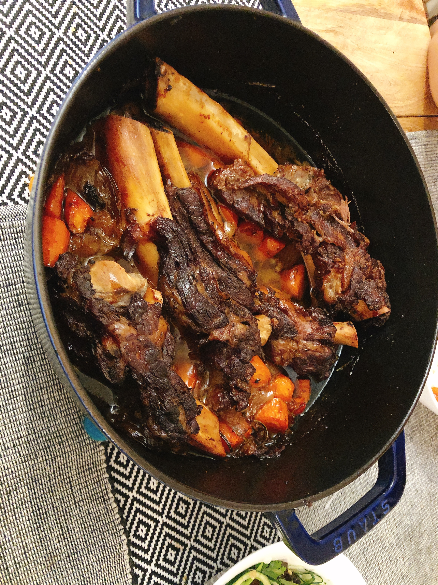

慢烤牛肋排

ingridients: 

Beef Back Rib			4 ct
Rosemary		   	    1 stem
Garlic Powder			适量
Grounded black pepper   适量
Maple Syrup				适量
海盐						适量
生抽						适量
蚝油						适量
Olive Oil				适量
Whisky					适量
Chicken Stock			适量
洋葱						一个
胡萝卜					2-3根

Step 1: 牛肋排放冷水浸泡至血水清除
Step 2: 将牛肋排洗净捞出擦干；洋葱切片, 与Garlic Powder, Maple Syrup, 海盐，生抽，蚝油，黑胡椒粉一起在牛肋排上拌匀； 放入保鲜袋中冷藏过夜
Step 3: 中火把铸铁锅烧热，加入洋葱片，牛肋排煎出香味，倒入鸡威士忌酒， 倒入少许鸡高汤烧开，迷迭香喷枪炙烤，放入锅中
Step 4：烤箱预热260F，铸铁锅加盖烤3-3.5小时
Step 5: 烤箱升温到350F，开盖烤40min-1小时，观察汤汁收干即可